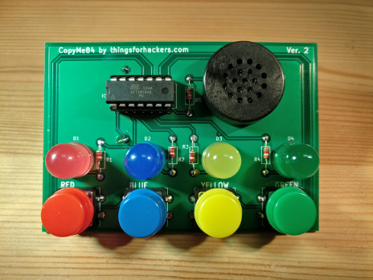

# CopyMe84

## Introduction

This repo contains the source code and KiCad project files for our CopyMe84 game kit.

The CopyMe84 game plays very similar to the classic "Simon Says" electionic game.

A complete kit looks like this:

Please visit [our store](https://thingsforhackers.com/store/) to purchase this kit.

When 1st powered on, i.e. when you insert the battery, it will play a nice('ish) title tune. After one loop of this tune, the game will enter power saving mode, press any button to wake it up.

To start the game, press any button during the title tune. The game play consitst of remember the sequence of LEDs, and pressing the corrosponding buttons in the correct order to repeat the sequence. Each sucessful loop the game will add another step to the sequence. To help, each LED flash is accompanied by a different beeper tone.

## HW Build Instructions

Full HW build instructions can be found on our [blog](https://thingsforhackers.com/post/build-instructions-copyme-84a/).

## SW Build Instructions

The kit contains a pre-programmed Ateml ATtiny84A microcontroller. However, as this is an open souce product you are albe to, infact we strongly encourge you to, modify, build and try out the code for yourself.

Inorder to build the code, you'll need a compiler that can target the Ateml AVR range of products. I would suggest starting [here](http://www.nongnu.org/avr-libc/user-manual/index.html).

If you're lucky enough to be on some sort of Linux box, I've written up [full instructions](https://thingsforhackers.com/post/installing-avr-libc/) on how to install the gcc tool chain for the AVRs.

Assuming you've got the gcc toolchain installed, the following shows you how to build the code:

If you haven't already, clone the github repo: `git clone git@github.com:thingsforhackers/CopyMe84.git`

Then simply `cd CopyMe84`, and type `make`.

If all went well, inside of the *obj* directory, you will find *copyme84.bin* & *copyme84.hex*, you should be able to use one of these files to program the ATtiny84A.

We use the *Mini Pro TL866CS programmer* to program pretty much all our products. You can pick one up from our [eBay store](http://www.ebay.co.uk/usr/thingsforhackers).

Which ever method you use to program, please ensure the *fuse* bits of the ATtiny84A are programmed as follows:

Byte | Value
-----|------
Low | 0x62
High | 0x5F
Ext | 0xFF

